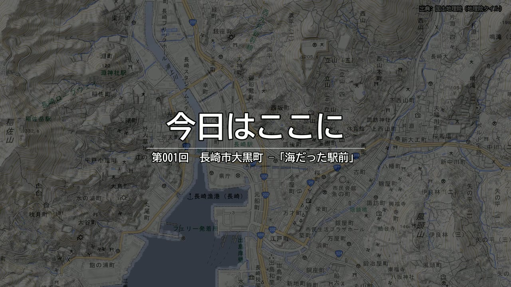
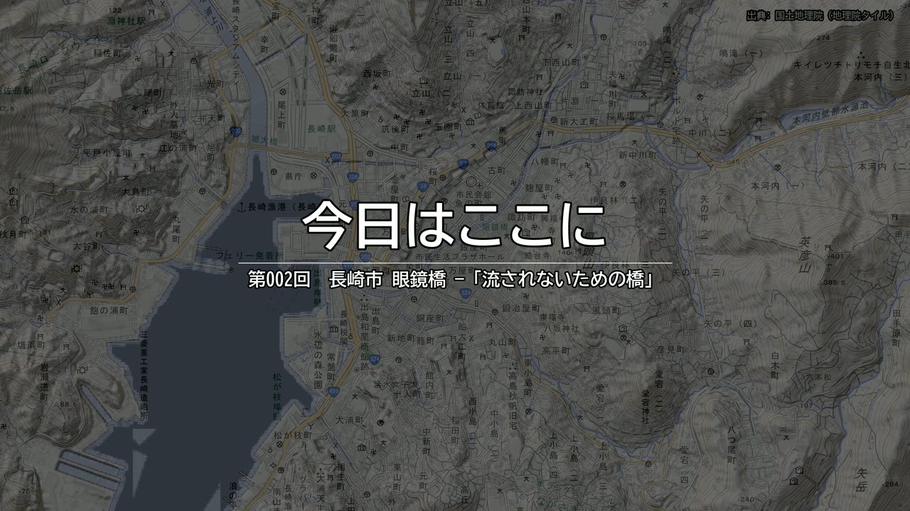
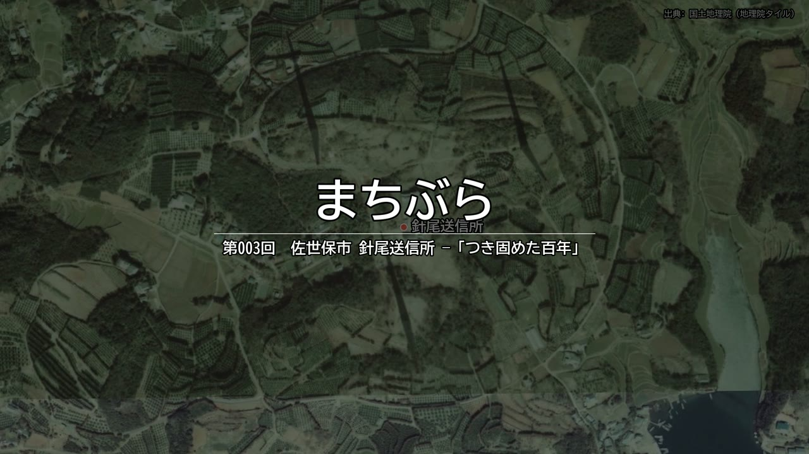
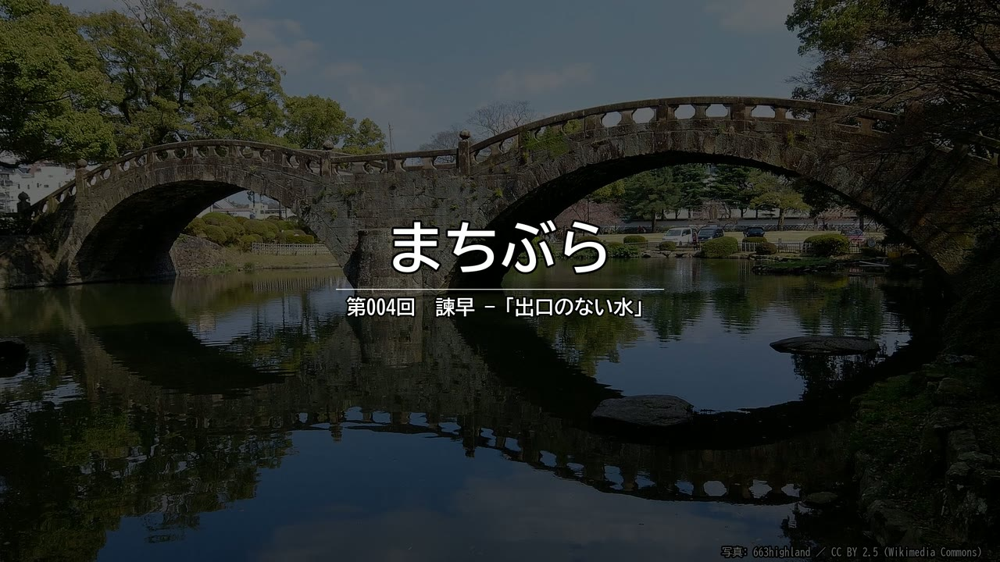
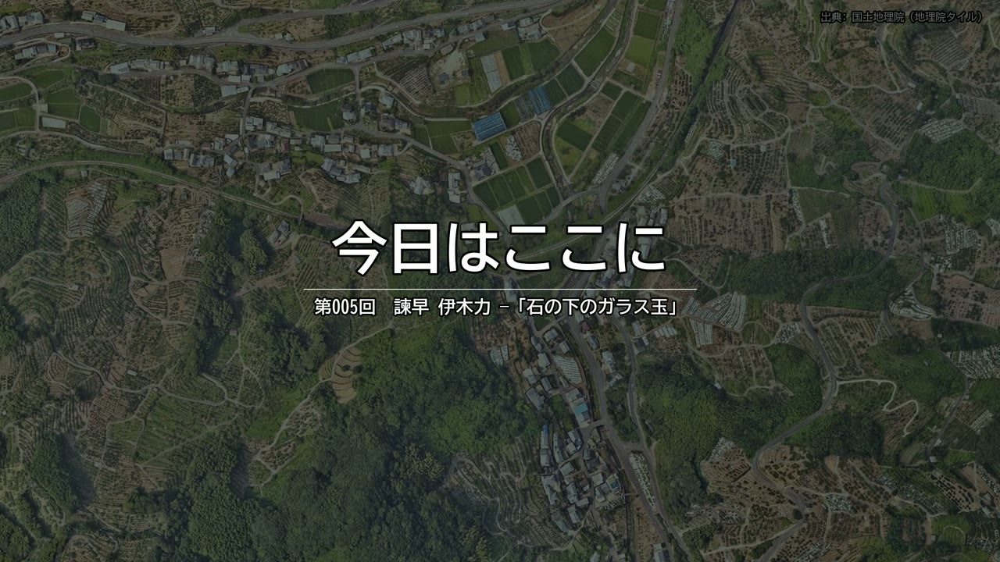
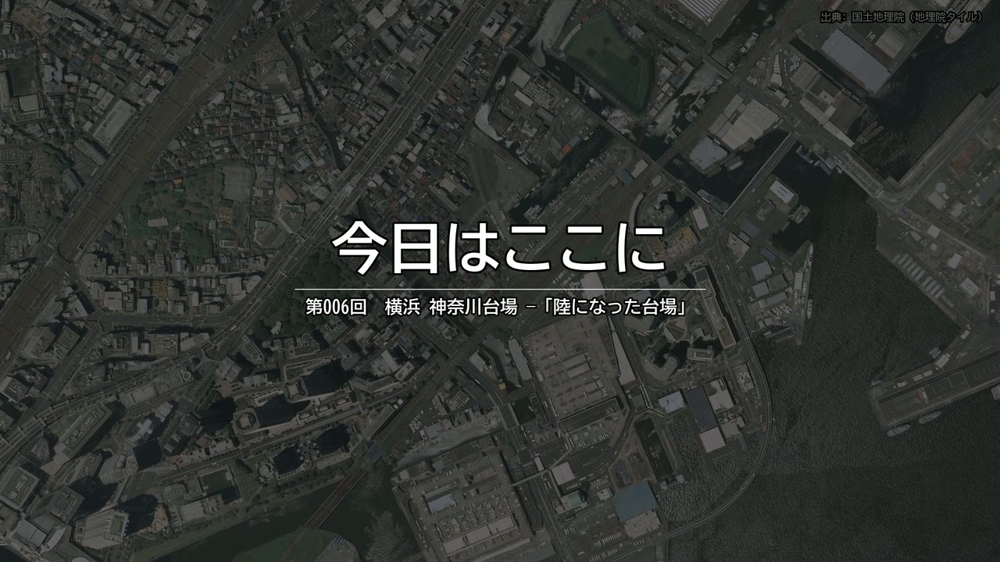
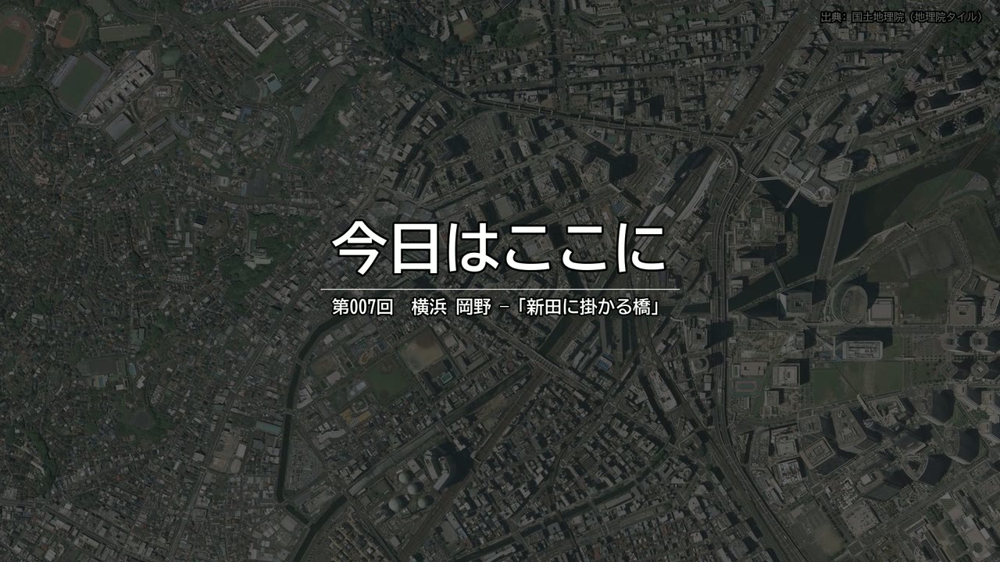

# 今日はここに

〒や町名を指定すると、その町の遺構・歴史建造物・地名の由来にまつわる
「碑」の話を集め、読み上げシナリオを作り、VOICEVOX と地図で動画にする。

本編は **YouTube** で公開しています（[再生リスト](https://www.youtube.com/playlist?list=PLdANPudLNm-c)）。
第001〜005回の本編は以前 Releases に置いていましたが、YouTube に移しました。
ここに入っているのはポスターと、アバン（掴み）のプレビューだけです。
動画そのものを git に入れると、録り直すたびにリポジトリが本編1本分
太っていくためです。

調査メモ・台本・構図・ツールは **[lancard-aikawa/kyokoko](https://github.com/lancard-aikawa/kyokoko)**（MIT）にあります。

---

## 第001回 長崎市大黒町 —「海だった駅前」

9分53秒

1. 処刑場から、港が見えた
2. 教会の跡に、お寺が建っている
3. 海を失った町が、船を担ぎ続けている

**[YouTube で見る](https://youtu.be/f7xuXU-avK0)**　/　[プレビュー（アバン）](001-nagasaki-daikokumachi/preview.mp4)

---

## 第002回 長崎市 眼鏡橋（中島川） —「流されないための橋」

7分04秒

1. 流されないために、石で架けた
2. その橋が、流された
3. 石を拾い集めて、また架けた

**[YouTube で見る](https://youtu.be/4qyxsQsx8-s)**　/　[プレビュー（アバン）](002-nagasaki-meganebashi/preview.mp4)

---

## 第003回 佐世保市 針尾送信所（針尾島） —「つき固めた百年」

8分23秒

1. 塔は、電波を出していない
2. 生コンのない時代の、136メートル
3. 百年たって、無傷

**[YouTube で見る](https://youtu.be/YBlXiOLEogM)**　/　[プレビュー（アバン）](003-sasebo-hario/preview.mp4)

---

## 第004回 諫早市 諫早公園・諫早湾 —「出口のない水」

8分14秒

1. 流されなかった橋
2. 出口が塞がる土地
3. 湾を閉じる

**[YouTube で見る](https://youtu.be/Og2XCHAjWck)**　/　[プレビュー（アバン）](004-isahaya-wan/preview.mp4)

---

## 第005回 諫早市 多良見町伊木力（千々石ミゲル夫妻墓所） —「石の下のガラス玉」

10分19秒

1. ローマへ行った少年
2. 名前を変えた人
3. 掘る

**[YouTube で見る](https://youtu.be/w46CJ8AqcOc)**　/　[プレビュー（アバン）](005-isahaya-ikiriki/preview.mp4)

---

## 第006回 横浜市神奈川区神奈川一丁目（神奈川台場跡） —「陸になった台場」

9分47秒

1. 海に築く
2. 撃たない大砲
3. 陸に呑まれる

**[YouTube で見る](https://youtu.be/e7nrckVpE8s)**　/　[プレビュー（アバン）](006-kanagawa-daiba/preview.mp4)

---

## 第007回 横浜市西区岡野（新田間橋・横浜道） —「新田に掛かる橋」

7分37秒

1. 浅くなった入江
2. 鍋屋の新田
3. 開港の道

**[YouTube で見る](https://youtu.be/meRAp09Wm0k)**　/　[プレビュー（アバン）](007-nishi-okano/preview.mp4)

---

## 出典

- 地図: 出典 国土地理院（地理院タイル）
- 碑文: 出典 国土地理院（自然災害伝承碑）
- 音声: VOICEVOX:春日部つむぎ / VOICEVOX:雀松朱司(CV:狐狗狸ラク)
- 写真: Wikimedia Commons（作者とライセンスは各回の photos.json）
